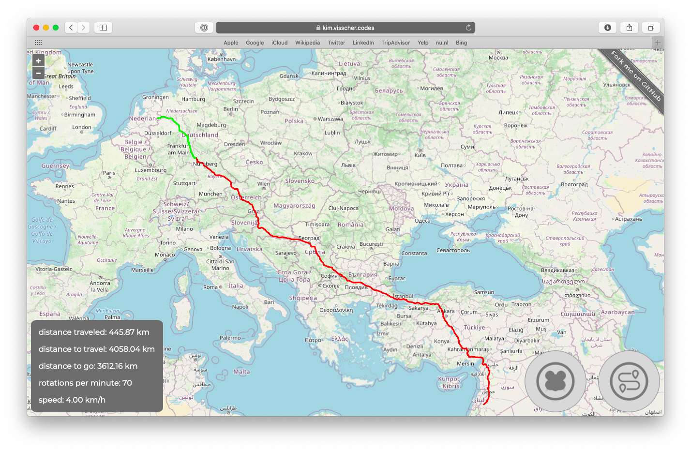

# ⭐🌎🐹 Virtual Hamster Journey 🐹🌎⭐

This repository contains code that one can use to make a "virtual hamster journey".




 

## Web Application
The web application shows the shows the current location of your hamster and how far along their journey they are.
The virtual route your hamster will travel is determined by the following file [route.gpx](./web/backend/public/route.gpx), you can replace this file by any desired GPX file as long as it contains at least one (valid) track.

## Microcontroller
The microcontroller (and the code uploaded to it) allows for for measuring the amount of rotations your hamster makes.
The microcontroller will communicate over MQTT to an given broker, the web application should be pointed towards the same broker as the microcontroller, such that events published by the microcontroller can be subscribed to by the web application.

## Requirements
- Node.js / npm
- Python / pip / rshell
- Docker (optional)
- MicroPython-able microcontroller (e.g. ESP32)
- digital Hall-effect sensor (e.g. A3144)
- temperature / humidity sensor (e.g. bme280)
- (self-adhesive neodymium) magnet
- MQTT broker (e.g. Eclipse Mosquitto)

## Installation and Usage

### Web Application
```bash
cd ./web/frontend
npm install
npm run production
cp dist/* ../backend/public/
cd ../backend
npm install
export NODE_ENV=production
npm run start
```

### Microcontroller
For wiring see [this Fritzing schematic](./esp32/res/breadboard.png).

```bash
cd ./esp32
rshell
connect serial /dev/tty/path/to/your/esp32
cp ./main.py /pyboard/
cp ./boot.py /pyboard/
cp ./bme280.py /pyboard/
repl
import upip
upip.install("micropython-umqtt.robust")
upip.install("micropython-umqtt.simple")
```
After following these instructions reboot your MicroPython-able microcontroller.

### Docker
```bash
cd ./web
docker build -f Dockerfile.amd64 -t virtual-hamster-journey .
docker run -it -p 8080:8080 -v /path/to/where/you/want/your/database:/usr/src/app/res virtual-hamster-journey
```

### Docker Compose
```bash
docker-compose up
```

## Contributing
Pull requests and issues are welcome.

## License
[MIT](./LICENSE.md)
